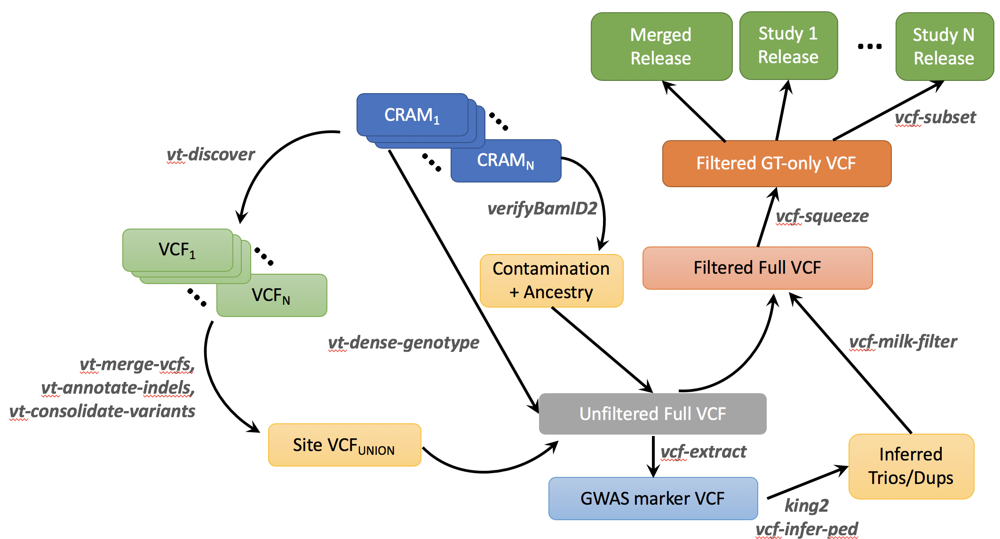

TOPMed Variant Calling Pipeline (latest: Freeze 8)
==================================================

Overview of this repository
----------------------------

This repository is intended to provide a collection of software tools used for producing TOPMed variant calls and genotypes with a comprehensive documentation that allows investigators to understand the methods and reproduce the variant calls from the same set of aligned sequence reads.

This repository reflects specific versions of software tools that are
under active development in the Center for Statistical Genetics
(CSG). Most of the latest version of these software tools can be
accessed through multiple repositories linked as submodules, this repository is focused on a freeze of software tools that can reproduce a variant calls compatible to the latest TOPMed Freeze (Freeze 8 currently).


Outline of the variant calling procedure
----------------------------------------

Our ``GotCloud vt`` pipeline detects and genotype variants from a list of aligned sequence reads. Specifically, the pipeline consist of the following six key steps. Most of these procedure will be integrated into ``GotCloud`` software package later this year. 

Our ``GotCloud vt`` pipeline detects and genotype variants from a list of aligned sequence reads. Specifically, the pipeline consist of the following six key steps. Most of these procedure will be integrated into ``GotCloud`` software package later this year. 

1. **Sample quality control** : For each sequenced genome (in BAM/CRAMs), the genetic ancestry, sequence contamination, and biological sex are inferred using ``cramore cram-verify-bam`` and ``cramore vcf-normalize-depth``. 
2. **Variant detection** : For each sequenced genome (in BAM/CRAMs), candidate variants are detected by ``vt discover2`` software tools, separated by each chromosome. The candidate variants are normalized by ``vt normalize`` algorithm. 
3. **Variant consolidation** : For each chromosome, the called variant sites are merged across the genomes, accounting for overlap of variants between genomes, using ``cramore vcf-merge-candidate-variants``, ``vt annotate_indels`` software tool.
4. **Genotype and feature collection** : For each 100kb chunk of genome, the genotyping module implemented in ``cramore dense-genotypes`` collects individual genotypes and variant features across the merged sites by iterating each sequence genome focusing on the selected region.  
5. **Variant filtering** : We use the inferred pedigree of related and duplicated samples to calculate the Mendlian consistency statistics using ``king``, ``vcf-infer-ped``, ``vt milk-filter``, and train variant classifier using Support Vector Machine (SVM) implemented in the ``libsvm`` software package and ``run-svm-filter`` software tool.





Installation
-------------
First, clone the repository by recursively cloning each submodule.
```
   $ git clone --recurse-submodules -j8 https://github.com/statgen/topmed_variant_calling
   (Use --recursive instead of --recurse-submodules for git version 2.12 or lower) 
```

Next, build each submodule using the following sets of commands 
```
   $ cd libsvm/; make; cd ..
   $ cd apigenome; autoreconf -vfi; ./configure --prefix $PWD; make; make install; cd ..
   $ cd cramore; autoreconf -vcf; ./configure; make; cd ..
   $ cd libStatGen; make; cd ..
   $ cd bamUtil; make; cd ..
   $ cd invNorm; make; cd ..
   $ cd htslib; autoheader; autoconf; ./configure; make; cd ..
   $ cd samtools; authoheader; autoconf -Wno-syntax; ./configure; make; cd ..
   $ cd bcftools; make; cd ..
   $ cd king; g++ -O3 -c *.cpp; g++ -O3 -o king *.o -lz; cd ..
```

Performing variant calling with example data
----------------------------------------------
To produce variant calls using this pipeline, the following input
files are neded:

 1. Aligned sequenced reads in BAM or CRAM format. Each BAM and CRAM file should contain one sample per subject. It also must be indexed using ``samtools index`` or equivalent software tools.
 2. A sequence index file. Each line should contain [Sample ID] [Full Path to the BAM/CRAM file]. See ``examples/index/list.107.local.crams.index`` for example.
 3. Genomic resource files, such as FASTA, dbSNP, HapMap files. An example collection of such resources is hosted at ``ftp://share.sph.umich.edu/1000genomes/fullProject/hg38_resources``
 
Here we use 107 public samples from the TOPMed project to document a
reproducible variant calling pipeline that resembles the latest
TOPMed variant calling pipeline. In order to do so, you need do
download the following two sets of files.

1. Download the resource files for the variant calling. The tarball
   package is available at
   ``ftp://share.sph.umich.edu/1000genomes/fullProject/hg38_resources``. The ``resources/`` directory is assumed to be present under ``examples/``directory
   in our tutorial. To download the data via command
   line, you may use the following command. Note that the file size is
   4.5GB, and it will take a significant amount ot time.

```
   $ cd examples/
   $ wget ftp://share.sph.umich.edu/1000genomes/fullProject/hg38_resources/topmed_variant_calling_example_resources.tar.gz
   $ tar xzvf topmed_variant_calling_example_resources.tar.gz
```

2. Download 107 CRAMs from the public GCS bucket.
   The CRAM files are publicly available via FTP at
   ``gs://topmed-irc-share/public``. However, if you want to access
   the data outside the Google Cloud, it will not be free of charge. 
   To download the files, you need to set the ``[PROJECT_ID]`` that is
   associated with a billing account, and use ``gsutil`` tool.
   The total amount of CRAM files is 2.17TB, and the estimate egress
   charge is $256 assuming $0.12/GB rate posted at https://cloud.google.com/compute/pricing#internet_egress
```
   gsutil -u [PROJECT_ID] -m cp -r gs://topmed-irc-share/public [DESTINATION_PATH]
```

   Here in the tutorial, we will assume that the files are stored or
   symbolic linked in the
   ``examples/crams`` directory.
   ``examples/index/list.107.local.crams.index`` file contains the
   sample ID and CRAM file path. The CRAM file and the corresponding
   indices (.cram.crai) must present before running the examples.
   
The TOPMed variant calling was performed on the Google Cloud. The
software tool `cloudify` supports running jobs on the Google Cloud,
but these examples are configured to run in a local
computer. Cloud-based versions will also be available later.

### Step 1. Sample QC and Variant Detection 

First, make sure to change your current directory to
``topmed_variant_calling/examples``, and run the following command.

```
 $ cd examples/

 $ ../apigenome/bin/cloudify --cmd ../scripts/run-discovery-local.cmd 
```

Then follow the instruction to run ``make`` with proper arguments to
complete the step. This step performs the following things
* Run ``vt discover2`` to detect potential candidate variants to
  generate per-sample BCF.
* Run ``verifyBamID2`` to jointly estimate genetic ancestry and DNA
  contamination.
* Run ``vcf-normalize-depth`` to calculate relative X/Y depth to
  determine the sex of sequenced genome.
  
Upon successful completion, we expect to see the following files for each sequenced genome represented by ``[NWD_ID]``. 
 * ``out/sm/[NWD_ID]/[NWD_ID].bcf``
 * ``out/sm/[NWD_ID]/[NWD_ID].bcf.csi``
 * ``out/sm/[NWD_ID]/[NWD_ID].vb2``
 * ``out/sm/[NWD_ID]/[NWD_ID].norm.xy`` 
  
More technical details can be found by directly examining
``../scripts/run-discovery-local.cmd``. The ``cloudify`` script take
this command file and iterate the command across all samples listed in
the index file in an idempotent manner using GNU ``make``.

After running the steps above, the ``verifyBamID2`` results and X/Y
depth results should be merged together into a single index file using
the following command:

```
  $ ../apigenome/bin/cram-vb-xy-index --index index/list.107.local.crams.index --dir out/sm/ --out out/index/list.107.local.crams.vb_xy.index
```

### Step 2. Hierarchical merge of variant sites across all samples

Next step is to merge the candidate variant sites across all sequenced
genomes. Even though the example file consist of only 107 samples, we
used a batch of 20 to show examples how to process hundreds of
thousands of genomes without opening all the files in a single
process. We typically process 1,000 samples per batch, and merge
hundreds of batches together later on.

```
  $ ../apigenome/bin/cloudify --cmd ../scripts/run-merge-sites-local.cmd 
```

This command will make a merged site list for each batch and each 10Mb
interval. These per-batch site list are further merged and
consolidated using the following command.

```
  $ ../apigenome/bin/cloudify --cmd ../scripts/run-union-sites-local.cmd
```

As a result, there will be merged and consolidated site list across
all samples for each 10Mb region at ``out/union/`` directory.

### Step 3. Hierarchical joint genotyping of merged variant sites

The merged site list can be jointly genotyped across the
samples. However, joint genotyping of >100,000s samples is not
straighforward. We again perform genotyping for 1,000 samples for eac
10Mb region. Next we hierarchically merge the genotypes across all the
batches, but with much smaller region size (e.g. 100kb) to maintain
the file size and running time manageable in a single machine. During
this joint genotyping step, we use the DNA contamination rate,
inferred genetic ancestries, and
inferred sex for more accurate genotyping.

In this example, we used a batch size of 20, and use 1Mb region size
when merging the genotypes across batches, to resemble the Freeze 8
calling pipeline.

First, generating per-batch genotypes for each 10Mb region can be
acheived using the following command:

```
  $ ../apigenome/bin/cloudify --cmd ../scripts/run-batch-genotype-local.cmd 
```

Next, pasting the genotypes across all batches while recalculating the
variant features is achieved using the following command:

```
  $ ../apigenome/bin/cloudify --cmd ../scripts/run-paste-genotypes-local.cmd
```

### Step 4. Inferring Duplicated and Related Individuals

The step above not only pastes the genotypes across the samples, but also
generate multiple versions of genotypes, such as ``minDP0`` (no
missing genotypes), ``minDP10`` (genotypes marked missing if depth is
10 or less)., and ``hgdp`` (extract only HGDP-polymorphic sites). 

The HGDP genotypes on autosomes can be merged together across all regions
using the following commands:

```
   $ cut -f 1,4,5 index/intervals/b38.intervals.X.10Mb.1Mb.txt | grep -v ^chrX | awk '{print "out/genotypes/hgdp/"$1"/merged."$1"_"$2"_"$3".gtonly.minDP0.hgdp.bcf"}' > out/index/hgdp.auto.bcflist.txt

   $ ../bcftools/bcftools concat -n -f out/index/hgdp.auto.bcflist.txt -Ob -o out/genotypes/hgdp/merged.autosomes.gtonly.minDP0.hgdp.bcf
```

These HGDP-site BCF file can be convered into PLINK format, and
pedigree can be inferred using ``king`` and ``vcf-infer-ped`` software
tools as follows. Note that ``plink-1.9`` is not the part of this repository and you need to obtain the software separately at https://www.cog-genomics.org/plink2 . 

```
   $ plink-1.9 --bcf out/genotypes/hgdp/merged.autosomes.gtonly.minDP0.hgdp.bcf --make-bed --out out/genotypes/hgdp/merged.autosomes.gtonly.minDP0.hgdp.plink --allow-extra-chr

   $ ../king/king -b out/genotypes/hgdp/merged.autosomes.gtonly.minDP0.hgdp.plink.bed --degree 4 --kinship --prefix out/genotypes/hgdp/merged.autosomes.gtonly.minDP0.hgdp.king

   $ ../apigenome/bin/vcf-infer-ped --kin0 out/genotypes/hgdp/merged.autosomes.gtonly.minDP0.hgdp.king.kin0 --sex out/genotypes/merged/chr1/merged.chr1_1_1000000.sex_map.txt --out out/genotypes/hgdp/merged.autosomes.gtonly.minDP0.hgdp.king.inferred.ped
```

The inferred pedigree file using these procedure only contains nuclear
families and duplicates in a specialized PED format. When a sample is
duplicated, all sample IDs representing the duplicated sample (in the
2nd column) need to presented in a comma-separated way. In the 3rd and
4th column to represend their parents, only representative sample ID (first
among comma-separated duplicate ID) is required. 

### Step 5. Run SVM variant filtering guided by the inferred pedigree.

Using the infered pedigree, we compute duplicate and Mendelian
consistency, and use the information to aid variant filtering. 
First, duplicate and Mendelian consistency is compute using the
following ``milk`` (Mendelian-inheritance under likelihood framework) command

```
   $ ../apigenome/bin/cloudify --cmd ../scripts/run-milk-local.cmd
```

The results are merged across each chromosome in the following way.

```
   $ cut -f 1,4,5 index/intervals/b38.intervals.X.10Mb.1Mb.txt | awk '{print "out/milk/"$1"/milk."$1"_"$2"_"$3".sites.vcf.gz"}' > out/index/milk.autoX.bcflist.txt

   $ (seq 1 22; echo X;) | xargs -I {} -P 10 bash -c "grep chr{}_ out/index/milk.autoX.bcflist.txt | ../bcftools/bcftools concat -f /dev/stdin -Oz -o out/milk/milk.chr{}.sites.vcf.gz"

   $ (seq 1 22; echo X;) | xargs -I {} -P 10 ../htslib/tabix -f -pvcf out/milk/milk.chr{}.sites.vcf.gz 
```

Finally, the SVM filtering step is performed using
``vcf-svm-milk-filter`` tool. The training is typically done with one
chromosome, for example ``chr2``.

```
   $ mkdir out/svm

   $ ../apigenome/bin/vcf-svm-milk-filter --in-vcf out/milk/milk.chr2.sites.vcf.gz --out out/svm/milk_svm.chr2 --ref resources/ref/hs38DH.fa --dbsnp resources/ref/dbsnp_142.b38.vcf.gz --posvcf resources/ref/hapmap_3.3.b38.sites.vcf.gz --posvcf resources/ref/1000G_omni2.5.b38.sites.PASS.vcf.gz --train --centromere resources/ref/hg38.centromere.bed.gz --bgzip ../htslib/bgzip --tabix ../htslib/tabix --invNorm $GC/bin/invNorm --svm-train $GC/bin/svm-train --svm-predict $GC/bin/svm-predict 
```

After finishing the training, the other chromosomes uses the same
training model to perform SVM filtering.

```
   $ (seq 1 22; echo X;) | grep -v -w 2 | xargs -I {} -P 10 ../apigenome/bin/vcf-svm-milk-filter --in-vcf out/milk/milk.chr{}.sites.vcf.gz --out out/svm/milk_svm.chr{} --ref resources/ref/hs38DH.fa --dbsnp resources/ref/dbsnp_142.b38.vcf.gz --posvcf resources/ref/hapmap_3.3.b38.sites.vcf.gz --posvcf resources/ref/1000G_omni2.5.b38.sites.PASS.vcf.gz --model out/svm/milk_svm.chr2.svm.model --centromere resources/ref/hg38.centromere.bed.gz --bgzip ../htslib/bgzip --tabix ../htslib/tabix --invNorm $GC/bin/invNorm --svm-train ../libsvm/svm-train --svm-predict ../libsvm/svm-predict 
```

The details of each steps are elaborated below.

Variant Detection Details
--------------------------
Variant detection from each sequence (ang aligned) genome is performed by ``vt discover2`` software tool. The script ``step-1-detect-variants.pl`` provide a mean to automate the variant detection across a large number of sequence genome.

The variant detection algorithm consider a variant as a potential candidate variant if there exists a mismatch between the aligned sequence reads and the reference genome. Because such a mismatch can easily occur by random errors, only potential candidate variants passing the following criteria are considered to be ***candidate variants*** in the next steps.

1. At least two identical evidence of variants must be observed from aligned sequence reads. 
  1. Each individual evidence will be normalized using the normalization algorithm implemented in ``vt normalize`` software tools.
  1. Only evidence on the reads with mapping quality 20 or greater will be considered.
  1. Duplicate reads, QC-passed reads, supplementary reads, secondary reads will be ignored. 
  1. Evidence of variant within overlapping fragments of read pairs will not be double counted. Either end of the overlapping read pair will be soft-clipped using ``bam clipOverlap`` software tool.  
1. Assuming per-sample heterozygosity of 0.1%, the posterior probability of having variant at the position should be greater than 50%. The method is equivalent to the `glfSingle` model described in http://www.ncbi.nlm.nih.gov/pubmed/25884587

The variant detection step is required only once per sequenced genome, when multiple freezes of variant calls are produced over the course of time.

 
Variant Consolidation
---------------------
Variants detected from the discovery step will be merged across all samples. This step is implemented in the ``step-2-detect-variants.pl`` scripts.

1. Each non-reference allele normalized by ``vt normalize`` algorithm is merged across the samples, and unique alleles are printed as biallelic candidate variants. The algorithm is published at http://www.ncbi.nlm.nih.gov/pubmed/25701572
2. If there are alleles overlapping with other SNPs and Indels, ``overlap_snp`` and ``overlap_indel`` filters are added in the ``FILTER`` column of the corresponding variant.
3. If there are tandem repeats with 2 or more repeats with total repeat length of 6bp or longer, the variant is annotated as potential VNTR (Variant Number Tandem Repeat), and ``overlap_vntr`` filters are added to the variant overlapping with the repeat track of the putative VNTR.     


Variant Genotyping and Feature Collection
-----------------------------------------
The genotyping step iterate all the merged variant site across the sample. It iterates each BAM/CRAM files one at a time sequentially for each 1Mb chunk to perform contamination-adjusted genotyping and annotation of variant features for filtering. The following variant features are calculated during the genotyping procedure. 

 * AVGDP : Average read depth per sample
 * AC : Non-reference allele count
 * AN : Total number of alleles
 * GC : Genotype count
 * GN : Total genotype counts
 * HWEAF : Allele frequency estimated from PL under HWE
 * HWDAF : Genotype frequency estimated from PL under HWD
 * IBC : [ Obs(Het) – Exp(Het) ] / Exp[Het]
 * HWE_SLP : -log(HWE likelihood-ratio test p-value) ⨉ sign(IBC)
 * ABE : Average fraction [#Ref Allele] across all heterozygotes
 * ABZ : Z-score for tesing deviation of ABE from expected value (0.5)
 * BQZ: Z-score testing association between allele and base qualities
 * CYZ: Z-score testing association between allele and the sequencing cycle
 * STZ : Z-score testing association between allele and strand
 * NMZ : Z-score testing association between allele and per-read mismatches
 * IOR : log [ Obs(non-ref, non-alt alleles) / Exp(non-ref, non-alt alleles) ]
 * NM1 : Average per-read mismatches for non-reference alleles
 * NM0 : Average per-read mismatches for reference alleles

The genotyping was done by adjusting for potential contamination. It uses adjusted genotype likelihood similar to the published method https://github.com/hyunminkang/cleancall, but does not use estimated population allele frequency for the sake of computational efficiency. It conservatively assumes that probability of observing non-reference read given homozygous reference genotype is equal to the half of the estimated contamination level, (or 1%, whichever is greater). The probability of observing reference reads given homozygous non-reference genotype is calculated in a similar way. This adjustment makes the heterozygous call more conservatively when the reference and non-reference allele is strongly imbalanced. For example, if 45 reference alleles and 5 non-reference alleles are observed at Q40, the new method calls it as homozygous reference genotype while the original method ignoring potential contamination calls it as heterozygous genotype. This adjustment improves the genotype quality of contaminated samples by reducing genotype errors by several folds.

Variant Filtering
-----------------
The variant filtering in TOPMed Freeze 8 were performed by (1) first calculating Mendelian consistency scores using known familial relatedness and duplicates, and (2) training SVM classifier between the known variant site (positive labels) and the Mendelian inconsistent variants (negative labels). 

The negative labels are defined if the Bayes Factor for Mendelian consistency quantified as ``Pr(Reads | HWE, Pedigree) / Pr(Reads | HWD, no Pedigree )`` less than 0.001. Also variant is marked as negative labels if 3 or more samples show 20% of non-reference Mendelian discordance within families or genotype discordance between duplicated samples.

The positive labels are the SNPs found polymorphic either in the 1000 Genomes Omni2.5 array or in HapMap 3.3, with additional evidence of being polymorphic from the sequenced samples. Variants eligible to be marked both positive and negative labels are discarded from the labels. The SVM scores trained and predicgted by ``libSVM`` software tool will be annotated in the VCF file. 

Two additional hard filtering was applied additionally. First is excessive heterozygosity filter ``(EXHET)``, if the Hardy-Weinberg disequilbrium p-value was less than 1e-6 in the direction of excessive heterozygosity. Another filter is Mendelian discordance filter ``(DISC)``, with 3 or more Mendelian discordance or duplicate discordance observed from the samples.

Questions
---------
For further questions, pleast contact Hyun Min Kang (hmkang@umich.edu) and Jonathon LeFaive (lefaivej@umich.edu).
